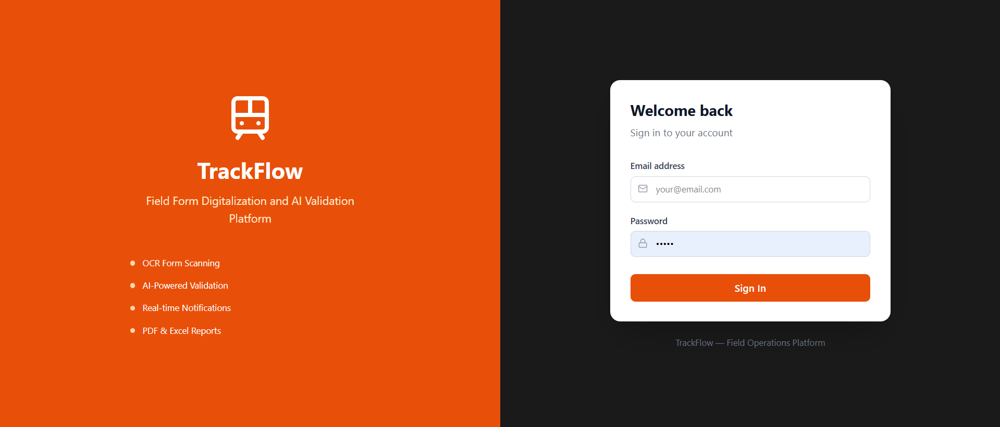
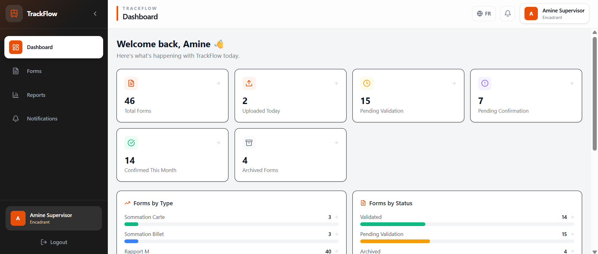
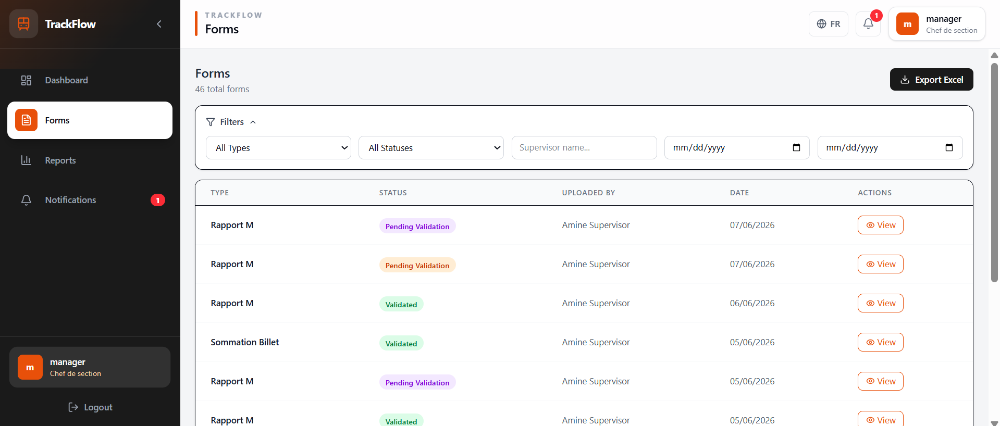
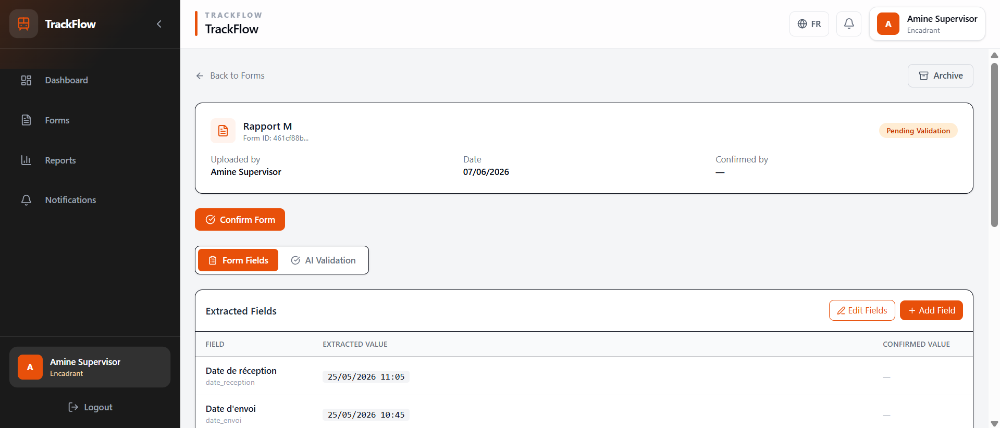
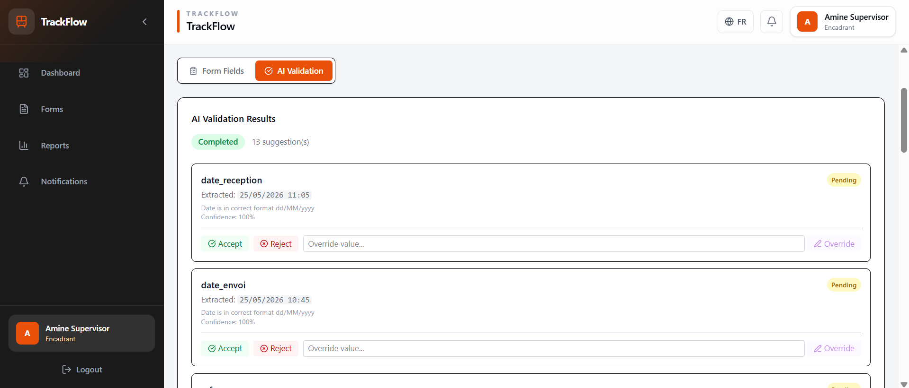
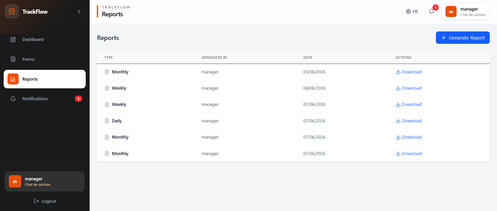
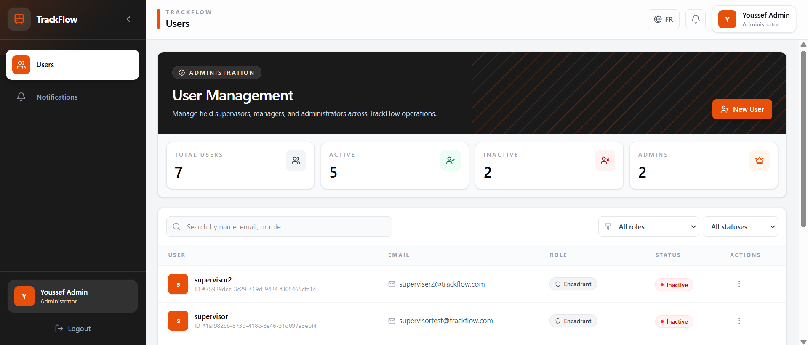

<div align="center">


# TrackFlow

### Field Form Digitalization & AI Validation Platform

**A production-grade web platform that digitizes and automates railway field form processing — from OCR scanning and AI-powered data extraction, to validation, audit logging, and report generation.**

[](https://spring.io/projects/spring-boot)
[](https://reactjs.org/)
[](https://openjdk.org/)
[](https://www.postgresql.org/)
[](https://www.rabbitmq.com/)
[](https://www.docker.com/)
[](LICENSE)

[Features](#features) • [Architecture](#architecture) • [Tech Stack](#tech-stack) • [Getting Started](#getting-started) • [API Docs](#api-documentation) • [Screenshots](#screenshots)

</div>

---

## Overview

TrackFlow solves a real operational problem at **ONCF** (Office National des Chemins de Fer — Morocco's national railway): train controllers (ACTs) fill paper forms in the field, which supervisors then manually re-enter into Excel spreadsheets. This process is error-prone, time-consuming, and lacks traceability.

### The Problem
- ACTs fill **3 types of paper forms** in the field daily
- Supervisors **manually re-enter** data into Excel
- No validation, no audit trail, no real-time visibility
- Forms can be lost, misread, or incorrectly transcribed

### The Solution
TrackFlow replaces this entirely with:
- **Digital form scanning** with OCR text extraction
- **AI-powered field validation** using Groq (Llama 3.3 70b)
- **Human-in-the-loop confirmation** workflow
- **Automated PDF and Excel** report generation
- **Real-time notifications** via WebSocket and email
- **Full audit trail** with Spring AOP

---

## Screenshots

### Login Page
<!-- Add screenshot here -->


### Dashboard
<!-- Add screenshot here -->


### Forms List
<!-- Add screenshot here -->


### Form Detail — Field Extraction
<!-- Add screenshot here -->


### AI Validation Results
<!-- Add screenshot here -->


### Reports
<!-- Add screenshot here -->


### User Management
<!-- Add screenshot here -->


---

## Features

### ◈ Authentication & Security
- JWT-based stateless authentication (JJWT 0.12.6)
- Role-based access control — `FIELD_SUPERVISOR`, `MANAGER`, `ADMIN`
- Account activation on first login
- BCrypt password hashing
- Credential enumeration protection

### ◈ Form Management
- Upload scanned forms (PDF/Image)
- OCR text extraction (Tesseract 5)
- Automatic field structuring via Groq AI
- Form lifecycle: `UPLOADED → OCR_PROCESSING → PENDING_VALIDATION → PENDING_CONFIRMATION → CONFIRMED → ARCHIVED`
- Advanced filtering by type, status, date range, ACT name

### ◈ AI Validation Pipeline (Async)
- Async processing via **RabbitMQ** event queue
- **Groq API** (Llama 3.3 70b) validates extracted fields
- Domain-specific rules: ONCF station names, train durations, date formats
- Human-in-the-loop: `ACCEPT` / `REJECT` / `OVERRIDE` suggestions

### ◈ Infraction Status (Lettre de Sommation)
- Supervisors fill in infraction status manually
- `Régularisée` → Gare de Réglement + N° PP + Montant (Billet only)
- `Non Régularisée` → direct confirmation
- Locked after form confirmation

### ◈ Notifications
- Real-time WebSocket notifications (STOMP)
- Email notifications via Spring Mail (Mailtrap/Brevo)
- In-app notification center with unread counter
- Managers notified on every upload and validation

### ◈ Reporting
- PDF reports (iText 8)
- Excel reports (Apache POI) with form fields as columns
- `DAILY` / `WEEKLY` / `MONTHLY` / `CUSTOM` date ranges
- Role-based: supervisors see only their own forms
- Excel export with advanced filters

### ◈ Audit Logging
- Automatic logging via **Spring AOP**
- Zero business logic pollution
- Tracks all form and user actions with before/after snapshots
- Accessible to ADMIN and MANAGER

### ◈ User Management (Admin)
- Create users with auto-generated passwords
- Welcome email sent automatically
- Change role, activate/deactivate accounts
- Account stays inactive until first login

---

## Architecture

```
React Frontend (Vite + Tailwind CSS)
          ↕ REST API + WebSocket (STOMP)
Spring Boot Backend (Modular Monolith)
    ├── Auth Module
    ├── User Module
    ├── Form Module (OCR + Storage)
    ├── Validation Module (Groq AI)
    ├── Notification Module (WebSocket + Email)
    ├── Report Module (PDF + Excel)
    ├── Dashboard Module
    └── Audit Module (Spring AOP)
          ↕
PostgreSQL (Neon) + RabbitMQ (Docker)
          ↕
External: Groq API + Tesseract OCR + SMTP
```

### Async Event Flow
```
Form Upload
    → OCR (Tesseract) → Field Extraction (Groq)
    → form.submitted (RabbitMQ)
              ↓
    AI Validation (Groq Llama 3.3 70b)
              ↓
    validation.complete (RabbitMQ)
              ↓
    Email + WebSocket Notification → Manager + Supervisor
```

### Key Architecture Decisions
- **Modular monolith** over microservices — manageable for solo development, clean boundaries
- **@TransactionalEventListener(phase = AFTER_COMMIT)** — prevents race conditions between DB commit and RabbitMQ consumer
- **Human-in-the-loop AI** — never auto-corrects, supervisor always confirms
- **Validation rules in MD file** — data-driven, not hardcoded, easy to update
- **Spring AOP audit logging** — zero pollution in business logic

---

## Tech Stack

| Layer | Technology | Version |
|-------|-----------|---------|
| Backend | Spring Boot | 4.0.6 |
| Language | Java | 21 |
| Frontend | React + Vite | 19 |
| Styling | Tailwind CSS | 4 |
| Database | PostgreSQL (Neon) | 16 |
| Messaging | RabbitMQ | 3.13 |
| AI/LLM | Groq API (Llama 3.3 70b) | — |
| OCR | Tesseract 5 (Tess4J) | 5.11 |
| Auth | JWT (JJWT) | 0.12.6 |
| PDF | iText | 8.0.4 |
| Excel | Apache POI | 5.3.0 |
| Email | Spring Mail | — |
| WebSocket | Spring WebSocket + STOMP | — |
| Mapping | MapStruct | 1.6.3 |
| Schema | Flyway | 11 |
| API Docs | SpringDoc OpenAPI | 2.8.8 |
| Testing (BE) | JUnit 5 + Mockito | — |
| Testing (FE) | Playwright | — |
| Containers | Docker + docker-compose | — |
| CI/CD | GitHub Actions | — |
| Project Mgmt | Jira (Scrum — 8 sprints) | — |

---

## Getting Started

### Prerequisites
- Java 21
- Node 22 + npm
- Docker Desktop (for RabbitMQ)
- Tesseract 5 installed locally

### Clone the repository
```bash
git clone https://github.com/Zerrad0z/trackflow.git
cd trackflow
```

### Backend Setup

1. Create `trackflow-backend/src/main/resources/application-local.yml`:
```yaml
spring:
  datasource:
    url: jdbc:postgresql://YOUR_HOST/neondb?sslmode=require
    username: USERNAME
    password: PASSWORD
  mail:
    host: sandbox.smtp.mailtrap.io
    port: 2525
    username: MAILTRAP_USERNAME
    password: MAILTRAP_PASSWORD

jwt:
  secret: JWT_SECRET

groq:
  api:
    key: GROQ_API_KEY
    model: llama-3.3-70b-versatile
```

2. Start RabbitMQ:
```bash
docker compose up -d rabbitmq
```

3. Run the backend:
```bash
cd trackflow-backend
./mvnw spring-boot:run -Dspring-boot.run.profiles=local
```

### Frontend Setup
```bash
cd trackflow-frontend
npm install
npm run dev
```

Open `http://localhost:3000`

### Default Users
| Role | Email | Password |
|------|-------|----------|
| Admin | youssef@trackflow.com | admin123 |
| Supervisor | amine@trackflow.com | password123 |
| Manager | manager@trackflow.com | manager123 |

---

## API Documentation

Swagger UI available at:
```
http://localhost:8080/api/v1/swagger-ui/index.html
```

### Key Endpoints

| Method | Endpoint | Role | Description |
|--------|----------|------|-------------|
| POST | `/auth/login` | Public | Login → JWT token |
| GET | `/auth/me` | Any | Current user |
| POST | `/forms` | SUPERVISOR | Upload form scan |
| GET | `/forms` | All | List forms (filtered) |
| GET | `/forms/{id}/validations/latest` | All | AI validation results |
| PATCH | `/suggestions/{id}/decide` | SUPERVISOR | Accept/reject suggestion |
| POST | `/reports` | All | Generate PDF/Excel report |
| GET | `/forms/export` | MANAGER | Export filtered forms to Excel |
| GET | `/dashboard/stats` | All | Dashboard statistics |
| GET | `/audit` | ADMIN | Full audit logs |

---

## Testing

### Backend (JUnit 5 + Mockito)
```bash
cd trackflow-backend
./mvnw test
```
**23 unit tests** covering Auth, Form, Validation and User services.

### Frontend (Playwright E2E)
```bash
cd trackflow-frontend
npx playwright test
npx playwright show-report
```
**19 E2E tests** covering authentication, forms, dashboard and notifications.

---

## Author

**Oussama Zerrad**
- GitHub: [@Zerrad0z](https://github.com/Zerrad0z)
- LinkedIn: [linkedin.com/in/oussama-zerrad](https://linkedin.com/in/oussama-zerrad)

---

<div align="center">


*Based on a real freelance project at ONCF (Office National des Chemins de Fer)*

</div>